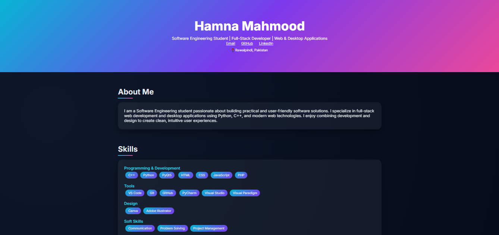
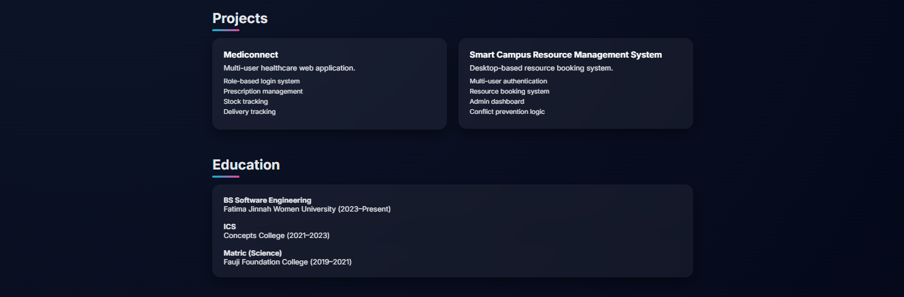
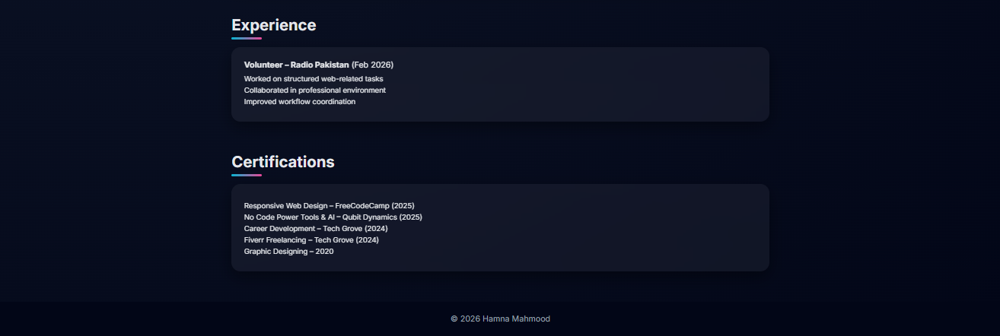
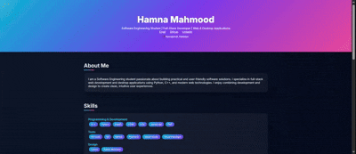

# Hamna Mahmood – Portfolio

Rawalpindi, Pakistan

Fatima Jinnah Women University (2023–Present)

Software Engineering Student | Full-Stack Developer | AI-Powered Applications  

---

## About

A modern, responsive personal portfolio website built to showcase my projects, technical skills, and development journey as a Software Engineering student.
Designed with a focus on clean UI, responsiveness, and professional presentation.

[View My Portfolio Website](https://hamna-mahmood.github.io/hamna-mahmood-portfolio/)

---

## Features

* Responsive and modern UI design
* Project showcase with detailed descriptions
* Skills and certifications section
* Clean and user-friendly layout

---
## Preview




## Demo Preview


---

## Tech Stack

* **Languages:** Python, C++, JavaScript, PHP
* **Frontend:** HTML, CSS
* **Backend:** MySQL
* **Desktop:** PyQt5
* **Tools:** Git, GitHub, VS Code

---

##  What I Learned

- Responsive web design principles
- UI/UX fundamentals
- Structuring a multi-page portfolio website
- Version control using Git & GitHub

---

## ⚙️ How to Run

1. Clone the repository

   ```bash
   git clone https://github.com/hamna-mahmood/hamna-mahmood-portfolio.git
   ```
2. Open the project folder
3. Run `index.html` in your browser

---

## Contact

📧 Email: [hamnamahmood004@gmail.com](mailto:hamnamahmood004@gmail.com)
🔗 LinkedIn: https://linkedin.com/in/hamnamahmood

---
